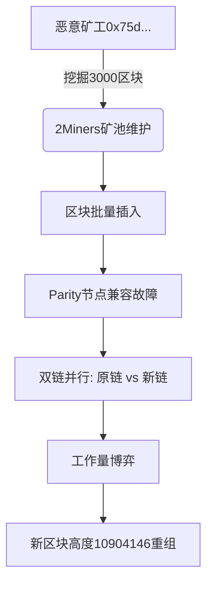

# 一名矿工引发的风波：以太坊经典区块链暂停交易事件解析

以太坊经典（ETC）作为区块链领域的老牌公链，近期因技术升级引发的链上分叉事件引发行业关注。本次事件中，核心开发工具的停用与矿工行为的连锁反应，暴露了去中心化网络在共识机制中的潜在风险。以下从事件经过、技术原理及行业影响三个维度展开深度剖析。

---

## 事件时间线梳理

### 第一阶段：开发工具停用（7月31日）
- **关键动作**：Multi-geth宣布终止对ETC的技术支持
- **触发原因**：ETC在Phoenix硬分叉期间违背"代码即法律"原则，导致智能合约回退函数失效
- **技术影响**：节点需自主选择替代链标准，潜在分裂风险加剧

### 第二阶段：矿池异常（8月1日）
- **异常表现**：2Miners矿池因维护短暂离线
- **意外后果**：离线期间累计的3000个区块被批量插入主链
- **节点冲突**：OpenEthereum/Parity节点无法兼容新区块

### 第三阶段：链重组完成（8月2日）
- **技术操作**：通过3693个区块的重组完成链上数据修正
- **共识机制**：工作量证明（PoW）主导链选择，多数节点切换至新区链

---

## 技术原理深度解析

### 分叉事件的触发机制

### 节点行为差异分析

| 节点类型        | 区块验证标准       | 链选择策略               | 兼容性状态 |
|-----------------|--------------------|--------------------------|------------|
| Core-Geth       | 严格遵循代码更新   | 接受批量插入区块         | 正常       |
| OpenEthereum    | 依赖历史共识规则   | 拒绝异常区块             | 冲突       |
| Parity          | 维护旧分叉协议     | 继续维护原始主链         | 冲突       |

---

## 是否构成51%攻击的争议焦点

### 关键证据分析
- **区块生成模式**：单矿工连续产出3000个区块（占比约12%）
- **网络算力分布**：2Miners矿池占ETC算力约19%，其他主要矿池未异常
- **时间关联性**：Multi-geth停用与异常区块生成间隔仅24小时

### 专家观点对比

| 观点类型       | 支持依据                     | 潜在风险                 |
|----------------|------------------------------|--------------------------|
| 意外技术故障论 | 矿池维护期间的区块堆积效应   | 暴露节点兼容性缺陷       |
| 系统性攻击论   | 区块批量插入与链重组异常     | 可能引发多次分叉风险     |
| 中立技术视角   | 尚未发现双花等恶意交易       | 需加强分叉检测机制       |

👉 [查看区块链安全指南](https://bit.ly/okx_welcome)

---

## 行业影响评估

### 短期影响（30天内）
- **交易层面**：约0.03%的交易延迟确认，交易所暂停充提操作
- **算力波动**：全网算力下降27%，部分矿工转向ETH Classic分叉链
- **市场反应**：ETC价格下跌14%，市值排名下降至第21位

### 长期风险预警
1. **共识机制脆弱性**：PoW机制下算力集中化趋势加剧
2. **开发工具依赖**：核心开发套件停用引发的连锁反应
3. **监管不确定性**：美国SEC对PoW链的合规审查风险

---

## 常见问题解答

### Q1: 本次事件是否造成用户资产损失？
A: 根据ETC Labs公告，重组过程中未检测到双花交易，异常区块主要为空块。交易所暂停充提操作有效规避了资金风险。

### Q2: 如何判断链重组是否完成？
A: 当全网95%以上节点同步至新区块高度（10904146），且连续24小时无新分叉产生即可判定重组完成。

### Q3: PoW链如何防范类似事件？
A: 可采取三项措施：
1. 实施动态难度调整算法（DAA）
2. 建立节点版本兼容性白名单
3. 引入轻节点快速同步协议

👉 [了解区块链安全解决方案](https://bit.ly/okx_welcome)

---

## 行业启示录

本次事件为区块链项目方敲响警钟，建议采取以下改进措施：

1. **开发工具管理**：建立多源代码仓库，避免单点失效风险
2. **节点升级机制**：设计渐进式升级路径，预留3个月兼容过渡期
3. **算力监控系统**：实时监测矿池算力分布，设置20%阈值预警
4. **应急响应协议**：制定链重组标准操作流程（SOP），明确交易所协作规范

随着以太坊2.0向PoS机制转型，ETC作为坚持PoW路线的公链，其生态发展面临更多技术与治理挑战。本次事件或将推动行业对"代码即法律"原则的重新审视，促使区块链项目在创新与稳定之间寻求更优平衡。

👉 [获取区块链技术白皮书](https://bit.ly/okx_welcome)