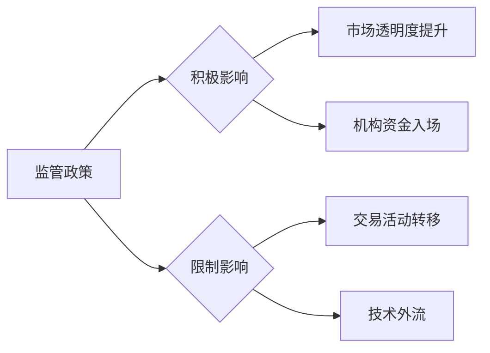

# 加密理财产品市场深度解析：现状、风险与未来策略

## 加密理财产品的定义与分类

加密货币理财产品通过区块链技术革新金融服务模式，为投资者提供数字资产增值机会。根据产品特性可分为两大核心类型：

1. **定期理财**：资金需锁定固定周期获取约定收益
2. **活期理财**：支持随时存取但收益率浮动

这种创新金融工具正逐渐成为传统银行储蓄的补充选项，为投资者开辟新收益渠道。

👉 [了解主流加密理财平台](https://bit.ly/okx_welcome)

## 市场规模与发展趋势

### 全球市场增长数据
| 年份 | 市场规模（亿美元） | 增长率 |
|------|--------------------|--------|
| 2021 | 2920               | 600%↑  |
| 2023 | 50+                | 持续增长|

*注：数据来源Datos数据平台*

市场呈现三大发展特征：
1. 传统金融机构加速布局加密托管业务
2. 比特币等主流资产持续获得机构认可
3. 新兴代币与NFT等创新产品不断涌现

### 投资者画像分析
- **核心群体**：30-45岁科技新贵（占78%）
- **资产特征**：高净值人群占比达65%
- **投资偏好**：短期（1-3个月）与中期（3-12个月）为主

## 产品体系深度解析

### DeFi理财产品矩阵
1. **Curve**：稳定币交易龙头（3pool年化2.44%）
2. **Aave**：跨链借贷平台（AMM市场USDT利率7.66%）
3. **Compound**：经典借贷协议（USDC最高2.97%）
4. **Yearn**：收益聚合器（Fantom DAI Vaults达24.96%）

### CeFi产品生态
**稳定币理财**：
- 火必高息活期：USDT年化3-5%
- OKX灵活存取：支持多币种复利投资

**非稳定币方案**：
- 定投计划：平抑市场波动的智能投资
- 质押服务：参与节点建设获取收益

👉 [探索DeFi与CeFi产品差异](https://bit.ly/okx_welcome)

### FAQ：产品选择指南
**Q：新手如何选择理财产品？**  
A：建议从低风险稳定币活期开始，逐步了解产品机制

**Q：DeFi与CeFi哪个更安全？**  
A：CeFi需审查平台资质，DeFi需评估智能合约风险

**Q：如何平衡收益与风险？**  
A：建议将高波动资产配置控制在总资产30%以内

## 核心风险矩阵

### 四大风险维度解析
1. **市场风险**：价格波动剧烈（单日波动超10%常见）
2. **流动性风险**：小市值代币折价率可达15-20%
3. **技术风险**：2022年DeFi攻击损失超25亿美元
4. **监管风险**：全球38个国家实施差异化监管政策

### 风险管理策略
| 风险类型 | 防范措施 |
|----------|----------|
| 市场波动 | 建立止盈止损机制 |
| 流动性不足 | 配置组合包含稳定币 |
| 技术漏洞 | 选择审计报告完备的协议 |
| 监管变化 | 关注主要司法管辖区政策动向 |

## 监管环境全景图

### 全球监管格局
- **开放市场**：瑞士（加密谷）、新加坡（MAS监管框架）
- **审慎监管**：美国（SEC证券属性认定）、欧盟（MiCA法案）
- **严格限制**：部分国家实施交易禁令

### 监管影响分析

👉 [了解全球合规发展动态](https://bit.ly/okx_welcome)

## 未来发展趋势

### 发展潜力
- 预计2023-2028年复合增长率达82.4%（Research And Markets数据）
- 机构投资者配置比例有望从1%提升至7%（Coinshares研究）

### 行业挑战
1. 估值体系缺失导致投机行为
2. 全球监管碎片化增加合规成本
3. 资产管理系统成熟度不足
4. 网络安全威胁持续升级

### 投资者策略建议
1. 建立多元化投资组合（稳定币+主流币+创新资产）
2. 定期进行风险评估（建议季度调整）
3. 关注合规进展（重点关注欧盟MiCA实施）

## 行业展望

随着区块链技术的迭代升级，加密理财市场将呈现三大趋势：
1. 监管框架逐步完善（预计2025年前后主要经济体将出台细则）
2. 传统金融加速融合（银行系产品占比将超40%）
3. 技术创新驱动（跨链、隐私计算等技术应用深化）

### FAQ：未来机遇
**Q：哪些细分领域最具潜力？**  
A：合规稳定币、机构级托管服务、收益优化协议

**Q：如何应对市场波动？**  
A：采用动态再平衡策略，设置10%-15%波动预警线

**Q：长期投资需关注哪些指标？**  
A：链上活跃地址数、机构持仓变化、全球支付采用率