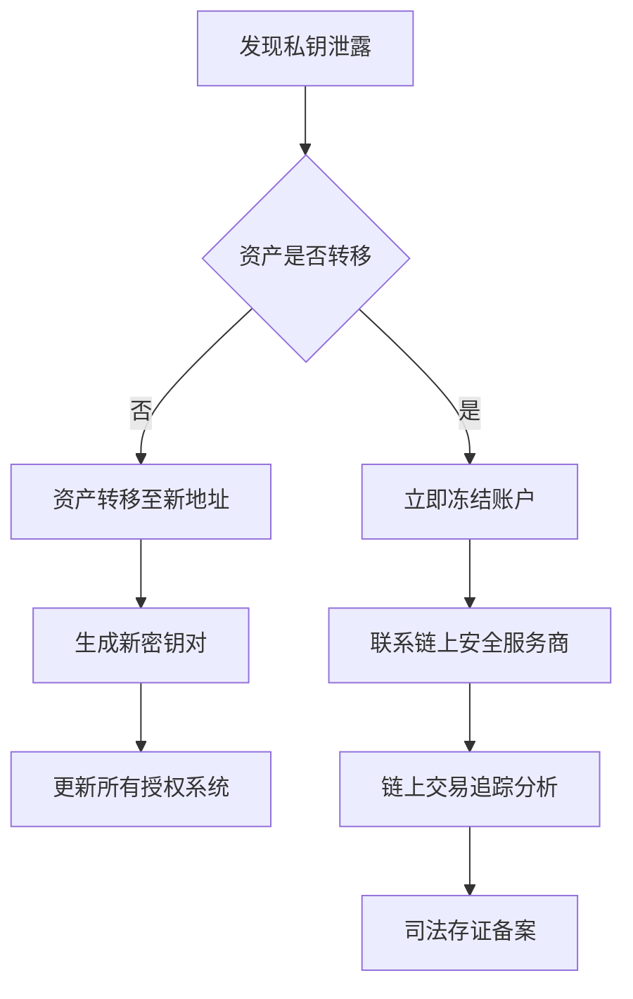

# 区块链钱包私钥的作用与安全性解析

在数字化浪潮席卷全球的今天，区块链技术正重塑金融基础设施的核心逻辑。作为数字资产的"数字主权凭证"，私钥在区块链生态系统中扮演着不可替代的关键角色。本文将从技术原理、安全策略到行业实践，深度解析私钥的本质特征与防护体系。

## 私钥的技术本质与核心价值
私钥（Private Key）本质上是通过加密算法生成的256位随机数，其数学特性决定了其不可逆性和唯一性。在椭圆曲线加密算法（ECDSA）框架下，私钥与公钥形成非对称加密对，构成区块链交易的数字签名验证体系。

| 技术维度 | 私钥功能 | 公钥功能 |
|---------|----------|----------|
| 生成方式 | 随机数生成器产生 | 通过私钥计算得出 |
| 安全要求 | 绝对保密 | 可公开传输 |
| 核心作用 | 交易签名授权 | 验证签名有效性 |
| 丢失后果 | 资产永久冻结 | 无直接影响 |

私钥的核心价值体现在三个维度：
1. **资产控制权**：持有私钥即拥有对应地址内数字资产的完全处置权
2. **交易确权机制**：通过数字签名技术实现交易不可篡改与不可抵赖
3. **去中心化基础**：消除传统金融中介，实现点对点价值转移

👉 [了解区块链底层技术原理](https://bit.ly/okx_welcome)

## 私钥安全管理的黄金法则
### 存储策略矩阵
| 防护等级 | 热存储方案 | 冷存储方案 |
|---------|------------|------------|
| 安全系数 | ★★☆☆☆     | ★★★★★     |
| 操作便捷 | 即时在线交易 | 需物理接入设备 |
| 推荐场景 | 小额日常支付 | 长期资产存储 |
| 典型载体 | 手机钱包   | 硬件钱包/纸钱包 |

**五层防护体系**：
1. **物理隔离**：采用硬件钱包或离线存储设备，阻断网络攻击路径
2. **多重验证**：实施2-of-3多重签名方案，分散密钥管理风险
3. **生物认证**：结合指纹/虹膜识别技术，增加生物特征验证层
4. **动态加密**：使用BIP39助记词协议生成可恢复的密钥种子
5. **安全审计**：定期进行漏洞扫描与渗透测试，更新加密算法

### 私钥泄露应急处理流程

## 助记词与私钥的技术关联
BIP39协议定义的助记词系统通过熵值生成12-24位单词序列，其本质是私钥的可记忆形态。两者具有数学层面的等价性，任何持有助记词的第三方均可推导出对应私钥。建议采用以下安全措施：
- 物理存储：使用钛合金材质的助记词备份工具
- 分片存储：将助记词拆分为多个部分异地保存
- 隐写术应用：通过Steganography技术将助记词隐藏于数字文件

👉 [获取专业级密钥管理方案](https://bit.ly/okx_welcome)

## 行业安全实践与技术创新
2024年区块链安全报告显示，私钥管理漏洞导致的损失同比下降37%，主要得益于：
- 门限签名技术（TSS）的普及应用
- 可恢复加密方案（RCS）的创新突破
- 零知识证明在密钥验证中的实践

头部钱包服务商已实现：
- 动态私钥轮换机制
- AI异常交易监测系统
- 量子安全加密预研项目

## 未来演进方向
1. **生物特征融合**：基于DNA信息的加密技术研究
2. **量子抗性算法**：NIST标准的后量子加密迁移方案
3. **去中心化身份**：DID与区块链钱包的深度整合

FAQ：
1. **如何验证私钥安全性？**  
使用开源工具进行熵值检测，确保符合256位加密标准

2. **冷存储是否绝对安全？**  
物理隔离有效防范网络攻击，但需防范设备丢失等物理风险

3. **助记词能否修改？**  
助记词是私钥的映射表达，修改相当于生成全新密钥对

4. **如何选择钱包服务商？**  
优先考虑通过CertiK、Hacken等权威机构认证的平台

5. **量子计算威胁如何应对？**  
关注IETF后量子加密标准进展，适时升级量子安全算法

私钥安全管理是数字资产管理的基石，需要技术防护、安全意识、应急机制的三维联动。随着Web3.0生态的发展，私钥管理技术将持续进化，但其核心原则——"私钥即主权"的底层逻辑将始终不变。用户应当建立"安全无绝对"的认知，通过多层次防护体系将风险控制在可接受范围内。

👉 [体验下一代区块链钱包安全方案](https://bit.ly/okx_welcome)