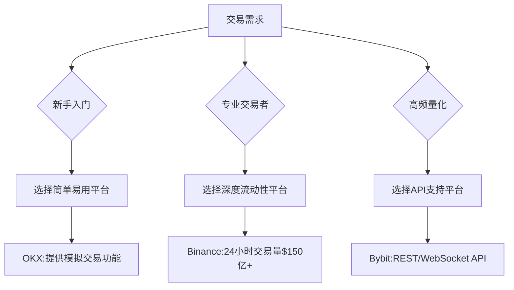

# 如何做空加密货币：最佳策略与方法解析

## 一、做空加密货币的核心方式
做空加密货币的核心在于**通过价格下跌获利**，主要包含以下五种主流方式：

1. **差价合约（CFDs）**  
   - 无需持有实物资产即可参与价格波动
   - 支持杠杆交易（最高可达100倍）
   - 适合短期波动交易者

2. **期权交易**  
   - 买入看跌期权锁定未来卖出价
   - 最大亏损仅限权利金
   - 适合中长期价格预判

3. **期货合约**  
   - 按约定价格进行标准化交易
   - 支持双向开仓（做多/做空）
   - 适合有经验的专业交易者

4. **二进制期权**  
   - 固定收益/亏损结构
   - 适合快速决策型交易
   - 风险收益明确但胜率重要

5. **借贷做空**  
   - 借入加密货币后卖出
   - 等待价格下跌后归还获利
   - 需支付借贷利息

👉 [立即体验OKX平台](https://bit.ly/okx_welcome)

## 二、七步实操指南
**Step 1：选择交易平台**  
需重点关注：  
- 合规资质（如OKX的马耳他MGA牌照）  
- 杠杆倍数（主流平台提供10-125倍）  
- 资金安全（冷钱包存储比例）  
- 流动性（24小时交易量需超50亿美元）  

**Step 2：账户开通**  
完成KYC验证（通常需2-24小时），建议绑定谷歌验证器增强账户安全。

**Step 3：标的筛选**  
重点关注：  
- 市值前10的主流币种（BTC/ETH占市场70%以上份额）  
- 具备期货合约的币种  
- 具备高波动性的DeFi代币  

**Step 4：市场分析**  
结合三重分析法：  
| 分析维度 | 关键指标 | 工具示例 |
|---------|----------|----------|
| 技术分析 | RSI/MACD/布林带 | TradingView |
| 基本面 | 监管政策/链上数据 | Glassnode |
| 情绪面 | 恐贪指数/谷歌搜索量 | Alternative.me |

**Step 5：开仓操作**  
以BTC期货为例：  
1. 设置杠杆（新手建议3-5倍）  
2. 下达市价单/限价单  
3. 设置止损（通常为入场价5-10%）  
4. 设置止盈（风险回报比建议1:2）

**Step 6：仓位管理**  
- 动态调整止损位（移动止损法）  
- 加仓时机（突破关键支撑位时）  
- 强平预警（保持保证金率＞10%）

**Step 7：平仓时机**  
- 达到预设止盈/止损点  
- 市场出现反转信号（如RSI超买＞75）  
- 重大利好消息释放  

## 三、风险与机遇平衡术
### 风险控制矩阵
| 风险类型 | 触发条件 | 应对策略 |
|----------|----------|----------|
| 极端波动 | 黑天鹅事件 | 使用期权对冲 |
| 强制平仓 | 保证金不足 | 设置自动追加保证金 |
| 监管变化 | 政策收紧 | 分散多平台持仓 |
| 技术故障 | 交易所宕机 | 预设紧急平仓指令 |

### 盈利机会挖掘
1. **趋势交易**：  
   - 识别主要下跌趋势（周期＞1个月）  
   - 抓住周线级别空头排列  

2. **套利机会**：  
   - 现货与期货价差＞1%时  
   - 跨交易所价差（如BTC在Binance与OKX价差）  

3. **对冲策略**：  
   - 持有现货同时做空期货（降低波动风险）  
   - 跨币种对冲（BTC/ETH负相关性套利）  

👉 [立即体验OKX平台](https://bit.ly/okx_welcome)

## 四、技术分析实战指南
### 三大经典形态识别
1. **头肩顶形态**  
   - 右肩成交量显著萎缩（确认形态有效性）  
   - 颈线突破后目标跌幅=头部高度  

2. **双顶形态**  
   - 两次高点间隔＞7个交易日  
   - 成交量在第二个顶点明显减少  

3. **下降旗形**  
   - 急跌后整理时间＜原下跌时长  
   - 突破时成交量放大200%以上  

### 指标组合应用
- **RSI+MACD共振策略**  
  RSI连续3日＞70且MACD柱状线转负时，空头信号准确率提升40%

- **移动平均线系统**  
  采用5/20/60周期组合：  
  - 5日线下穿20日线形成死叉  
  - 60日线作为趋势支撑  

## 五、平台选择决策树

## 六、风险控制黄金法则
1. **仓位管理公式**：  
   单笔风险=账户总额×2%÷（入场价-止损价）×价格  

2. **分散原则**：  
   - 单品种持仓＜10%  
   - 现货/衍生品比例1:3  

3. **压力测试**：  
   模拟极端行情下的最大回撤  
   （建议模拟账户实测100次以上交易）

👉 [立即体验OKX平台](https://bit.ly/okx_welcome)

## FAQ精选

**Q：做空加密货币需要多少启动资金？**  
A：主流平台最低保证金要求约100美元，建议初始资金不低于5000美元以分散风险。

**Q：如何判断最佳开仓时机？**  
A：结合三重信号确认：  
1. RSI连续3日＞75（超买）  
2. 出现看跌吞没K线形态  
3. 链上活跃地址数下降15%以上  

**Q：强制平仓如何避免？**  
A：实施三级防护：  
1. 设置自动追加保证金（建议账户余额保留20%备用金）  
2. 使用条件单实时监控  
3. 避免满仓操作（最大仓位不超过账户30%）

**Q：哪些指标最有效？**  
A：专业交易者使用的黄金组合：  
- 日线级别：布林带+斐波那契回撤  
- 小时图：MACD柱状线+成交量  
- 情绪指标：CoinMarketCap恐慌指数  

**Q：如何测试交易策略？**  
A：三步验证法：  
1. 历史数据回测（2018-2022年行情）  
2. 模拟交易100小时以上  
3. 实盘小额测试（单笔＜100美元）  

## 行业数据参考
2023年Q2加密衍生品市场特征：  
- 期货未平仓量：$250亿美元（同比下降35%）  
- 日均交易量：$1500亿美元  
- 主流做空工具占比：  
  - 永续合约 68%  
  - 期权 22%  
  - CFDs 10%  

通过系统化的策略制定、严格的风险控制和持续的市场监测，做空加密货币可成为专业投资者的重要盈利工具。建议新手从模拟交易开始，在掌握技术分析与仓位管理技巧后再逐步增加实盘资金投入。